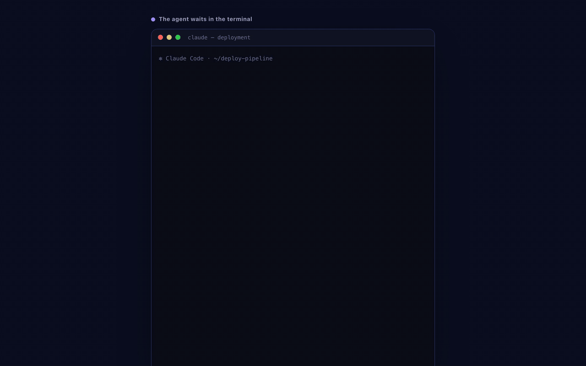

# Pane

**Human-in-the-loop for AI agents.** Your agent hands a human a real UI — a form, a picker, a dashboard, a diff to review — by URL, and gets the answer back as structured data. No GUI host app, no public address on the agent's side. Works from a cron job, a Slack bot, CI, or any headless server.

> Your agent can do anything except ask a human a real question. Pane fixes that.

  

[](https://paneui.com)

**Works with** any agent that can run a shell command or call HTTP — Claude Code & the Claude Agent SDK, LangGraph / CrewAI / OpenAI Agents SDK, or your own cron / CI / bot.

## Quickstart

Fastest path — register once, then one command. `pane demo` spins up a
short-lived sample pane on the hosted relay, opens it in your browser, and
prints the structured event back in your terminal the moment you interact
(it cleans the pane up on exit):

```sh
npx @paneui/cli agent register --name "my-agent"   # one-time, hosted relay
npx @paneui/cli demo                               # Node 20+ — round-trip in ~60s
```

Prefer to wire it up yourself:

```sh
npm i -g @paneui/cli                       # Node 20+
pane agent register --name "my-agent"      # one-time, uses the hosted relay
pane create --name hello \
  --template '<form onsubmit="event.preventDefault();pane.emit(\"hello\",{msg:this.m.value})"><input name=m><button>send</button></form>' \
  --event-schema '{"events":{"hello":{"emittedBy":["page"],"payload":{"type":"object","properties":{"msg":{"type":"string"}},"required":["msg"]}}}}'
pane watch <pane-id> --type hello          # open the URL it prints, type, hit send → see the JSON
```

## Reach for Pane when a text reply is the wrong shape

- **Approvals** — deploy gate, refund, PR merge: agent pauses, human clicks approve/reject, agent continues.
- **Forms & pickers** — collect structured input instead of parsing prose.
- **Doc / diff review** — human marks up a diff; agent gets per-line comments back.
- **Dashboards & status** — view-only panes the human just reads.
- **Lists & boards** — todo lists, checklists, kanban (records), mutated live.

[Try it in 60 seconds ↓](#run-yourself-human) · [How it works](#how-it-works) · [Agent reference](skills/pane/SKILL.md)

## The problem

*Apps are built for everyone; panes are built for you.* Agents can already emit rich output (the "ask Claude for HTML, not Markdown" pattern). But the human's reply is still prose. The agent → human channel is rich, the human → agent channel is a text box. Pane closes the loop: agent renders a UI (form, picker, doc-review view, dashboard, sketchboard), human manipulates it, every interaction emits structured data, the agent retrieves it (or pushes its own updates back into the same UI). The human "answers" by using a UI, not by typing.

This matters most for agents that live **outside a GUI host app**: cron agents, Slack/Telegram bots, CI agents, headless servers, personal-agent setups. None of them can use MCP Apps (which needs a host app to render the UI). Pane needs neither a host app nor a public address on the agent's side; the agent only makes outbound calls to the relay.

## Templates and panes — the model

Two nouns carry the whole system:

- A **template** is a reusable UI definition: the HTML, an optional event schema, and an optional input schema. Author it once.
- A **pane** is one *use* of a template — one context, one (or more) humans, one event log, one TTL. Many panes per template.

The intended flow is author-once, instance-many: register a template with `pane template create`, then spin up a pane each time you need it with `pane create --template-id <slug>` — no HTML re-sent, no regeneration. Per-instance data (the "which PR is this?" data that makes one PR-review template render *this* PR) rides in `--input-data`, which the page reads as `window.pane.inputData`. For a genuine one-off you can inline the HTML on `pane create --template '<...>'` and skip the named template entirely.

A template with **no** event schema is **view-only** — a report, dashboard, or chart the human only reads. Give it an event schema when you need an answer back.

## How it works

1. Agent authors (or reuses) a template — an HTML page, optionally with an event schema declaring what the page and the agent may emit.
2. Agent → `POST /v1/panes` with `{template_id | template, input_data, ttl}` → gets `{pane_id, urls, tokens, expires_at}`.
3. Agent delivers `urls.humans[0]` to the human over whatever channel it already has.
4. Human opens the URL. The relay serves a small shell page that loads the template in a **sandboxed iframe** (locked-down CSP), plus a tiny pane runtime exposing `window.pane` — `pane.emit(type, data)`, `pane.on(type, handler)`, `pane.state`, `pane.records`, `pane.inputData`.
5. Human interacts → each `pane.emit(...)` is POSTed to `/v1/panes/{id}/events` → appended to that pane's event log (validated against the schema; a wrong shape or wrong author is rejected).
6. Agent retrieves: stream over the WebSocket (`pane watch`), long-poll (`GET /v1/panes/{id}/events?since=<cursor>&wait=<s>` / `pane show --wait`), or register a webhook. The "ask the human" call blocks until the awaited event or a timeout.
7. Pane expires after `ttl`.

> **Event ordering.** A client connected over the WebSocket may receive an
> event via the broadcast stream *before* the `ack` for its own write of that
> same event. Clients de-duplicate on the event `id` — treat the `id`, not
> arrival order, as the source of truth.

## More than the round trip

The core round trip is the foundation; the relay also carries the pieces you need to build real, durable agent↔human surfaces:

- **Reusable templates + a marketplace.** `pane template create / list / search / show / version` manage named, versioned templates. A human can mark one **public** in the relay's web UI, giving it a listing other humans can browse and **install** into their own account.
- **Records** — per-pane mutable collections (posts, comments, kanban cards, line items) keyed by stable `record_key`, with optimistic locking and soft-delete. Use records when the *current value* matters and history doesn't; use events when history is the point. Declared with a `record_schema` (JSON Schema 2020-12 + the `x-pane-collections` extension).
- **Attachments** — upload images/PDFs/audio/video (`pane attachment …`), reference them by id in events, and let the page fetch them lazily or accept uploads back *from* the human. Capability-URL (`/b/<token>`) downloads, MIME sniffing, and EXIF stripping included.
- **SQL query** — `pane query "<SQL>"` runs read-only DuckDB SQL (a PostgreSQL-compatible dialect) scoped to your own panes, records, and events.
- **Multi-participant panes** — beyond the single auto-minted human URL, an owner can add identity-bound (email-invite) or public/anonymous participants. `pane participant list / new / revoke` manage URLs on a live pane.
- **Taste & feedback** — `pane taste` remembers a human's presentation preferences across runs so authored UIs stay consistent; `pane feedback` reports issues about pane itself.

See [`skills/pane/SKILL.md`](skills/pane/SKILL.md) — the agent-facing reference — for the authoritative, version-matched description of all of the above.

## How Pane compares

Pane is not a competitor to in-chat UI extensions — it owns a different
quadrant. **MCP Apps** (SEP-1865), **MCP elicitation**, and **AG-UI /
CopilotKit** all render UI *inside* a live host or chat session: a host app
(Claude Desktop, ChatGPT, VS Code) or your own front-end is present, the human
is looking at it, and the UI is torn down when the turn ends. Pane is for the
agents those approaches can't serve — the ones with **no session at all**: a
cron job, a CI pipeline, a Slack or Telegram bot, a headless server, or any case
where the human is on a different device than the agent. Agents that live
outside a GUI need a *callback URL*, not a chat window.

| | **Pane** | **MCP Apps** (SEP-1865) | **MCP elicitation** | **AG-UI / CopilotKit** |
|---|---|---|---|---|
| Where the UI renders | Standalone URL, any browser/device | Sandboxed iframe inside the MCP **host app** | Inside the MCP **client** (form/URL prompt) | Inside **your front-end app** |
| Needs a host app / live session | **No** — agent makes outbound HTTP only | Yes — an MCP host renders it | Yes — an MCP client must be connected | Yes — a running front-end + SSE session |
| Out-of-band delivery (URL to another device/channel) | **Yes** — hand the URL over Slack, Telegram, email, SMS | No — bound to the host UI | No — the client drives the prompt in-session | No — bound to the app the user is in |
| Survives the agent turn ending | **Yes** — pane lives until its TTL; the human can answer later | No — tied to the conversation turn | No — request is resolved within the call | No — tied to the live session |
| Persistent / mutable state | **Yes** — durable event log + mutable records per pane | Per-render component state | Single request/response | Session state (STATE_DELTA), app-managed |
| Self-hostable | **Yes** — one container, MIT | Spec only; depends on host | Spec only; depends on client | Open-source; you host the app + agent |

The rows pane wins on are exactly the headless/out-of-band ones: no host app,
URL-on-another-device delivery, an answer that can arrive minutes or hours later,
and state that outlives a single turn. If you *do* have a live host or front-end
session, MCP Apps / elicitation / AG-UI are the natural fit — render the UI right
where the human already is. Pane is the tool for everywhere else.

## Examples

Runnable, copy-pasteable examples live in [`examples/`](examples/):

- [`claude-code-approval/`](examples/claude-code-approval/) — a CLI agent (Claude Code or any shell agent) hands a human an "approve this plan?" pane and reads the decision back from `pane watch`.
- [`telegram-bot-approval/`](examples/telegram-bot-approval/) — a Telegram bot DMs the human a pane URL for a rich decision and receives the structured result over `@paneui/core`.
- [`ci-deploy-gate/`](examples/ci-deploy-gate/) — a GitHub Actions deploy gate: the pipeline posts a pane URL, a human approves/rejects with a reason, and a script polls the result and exits `0`/`1`.

## Install

No build step, no host app. Pick your audience — paste the agent block into your AI agent's chat, or run the human block yourself.

### Paste to your AI agent

Paste the block below into your AI agent's chat. It will install the CLI, register against the hosted relay, and install the Pane skill into its own skill directory.

````text
Install Pane for me. Pane lets you (the agent) build me (the human) a pane: a rich interactive UI hosted by URL, built for the moment I need it. If it captures input, you get my response back as structured data. Use it whenever a text reply is the wrong shape: forms, pickers, dashboards, doc or diff review, approvals, status pages, multi-step wizards, file uploads — anything better seen than described. Input is optional; a read-only dashboard or status view is a valid Pane.

Install everything at GLOBAL / USER scope, not in the current workspace. Pane is a personal capability I want available in every project, not a per-repo dependency. Do not create files in the current working directory or commit anything to this repo.

Do the following:
1. Install the CLI globally: `npm i -g @paneui/cli` (needs Node 20+). The binary is `pane`. Do not add it to the current project's package.json.
2. Install the Pane skill into your agent's GLOBAL / USER skill directory, not a project-local one. For example:
   - Claude Code: ~/.claude/skills/pane/SKILL.md  (NOT .claude/skills/ in the current repo)
   - Cursor: user-level rules, NOT .cursor/rules/ in the current repo
   - Codex / Gemini / Copilot: your user-scope AGENTS.md / GEMINI.md / instructions file, NOT the project root
   Run `pane skill show` to fetch the skill from the relay you're targeting — it prints the raw markdown to stdout, version-matched to that relay. Capture that output and save it in the appropriate format for your runtime (Claude Code keeps the markdown as-is; Cursor wants `.mdc` rules; Codex / Gemini compose it into the user-scope AGENTS.md / GEMINI.md).
3. Register against the hosted relay: `pane agent register --name "<short-descriptive-agent-name>"`. Pick a name that identifies your agent (e.g. `claude-code-lalit-macbook`, `cursor-work-laptop`) — the default is unhelpful. One-time, writes a key to ~/.config/pane/config.json (already user-scope).
4. Confirm install with `pane key list`. This round-trips your key against the relay and prints { agent_id, name, key_prefix, ... } — proves the CLI is installed AND registration succeeded.
5. Now exercise the round-trip end-to-end so I can see it work:
   - Create a simple two-way pane — a small inline HTML template with a text input and a submit button that emits an event back to you with `pane.emit("hello", {msg})` (use whatever shape `pane create --help` and the SKILL.md describe; the simplest "hello" form is fine).
   - Print the resulting pane URL (`urls.humans[0]`) and ask me to open it.
   - Start watching for the submit event (e.g. `pane watch <pane-id> --type hello`).
   - When I submit, show me the structured event payload you received. That's the "aha" moment — confirms the full round-trip works.

After this, reach for `pane create / show / send / watch` (and `pane template …` to reuse UIs) whenever a UI would communicate better than text. Run `pane <command> --help` for authoritative options.
````

### Run yourself (human)

Five commands. Needs Node 20+.

```sh
# 1. Install the CLI (Node 20+)
npm i -g @paneui/cli

# 2. Register with the hosted relay — pick a short, descriptive agent name
pane agent register --name "<short-descriptive-agent-name>"

# 3. Confirm — round-trips your key against the relay
pane key list

# 4. Install the skill into your agent. `pane skill show` prints the relay's
#    current, version-matched skill markdown to stdout — save it where your
#    runtime keeps skills (e.g. ~/.claude/skills/pane/SKILL.md for Claude Code).
pane skill show > ~/.claude/skills/pane/SKILL.md

# 5. Try it — create a tiny round-trip pane, then watch for the event.
#    Open the urls.humans[0] link it prints, type something, hit send.
pane create --name "Hello" \
  --template '<form onsubmit="event.preventDefault();pane.emit(\"hello\",{msg:this.m.value})"><input name=m><button>send</button></form>' \
  --event-schema '{"events":{"hello":{"emittedBy":["page"],"payload":{"type":"object","properties":{"msg":{"type":"string"}},"required":["msg"]}}}}'

pane watch <pane-id> --type hello
```

## Distribution

The repo is an npm-workspaces monorepo with four packages:

- **`@paneui/core`** — the relay client: a pure, framework-free HTTP + WebSocket library (`PaneClient` + `openStream`). Build any client on it.
- **`@paneui/relay`** — the relay server. Use the hosted instance, or self-host it as a single Docker container (SQLite by default) — see [Self-hosting](#self-hosting).
- **`@paneui/cli`** — the `pane` command-line tool. The agent's entry point: emits JSON on stdout, so it's harness-agnostic — works for an MCP host, a cron agent, a shell pipeline, a CI job, or a process supervisor. `pane watch <id> --type <event>` streams a pane as JSON-lines and exits when the awaited event lands. A LangChain tool wrapper may come later.
- **`@paneui/mcp`** — a thin stdio [MCP](https://modelcontextprotocol.io) server (binary `pane-mcp`). Point Claude Desktop, Cursor, or any MCP client at `npx @paneui/mcp` and Pane shows up as tools — `create_pane`, `get_events`, `send_to_pane`, and the record tools. See the [package README](packages/mcp/README.md) for client config snippets.

The CLI is `pane <command> [options]` — `create`, `show`, `send`, `watch`, `list`, `delete`, and `participant` operate on a pane; `template`, `attachment`, `records`, `query`, `taste`, `feedback`, `key`, `agent`, `config`, and `skill` are the other command groups. Run `pane --help` for the full list.

### Use from an MCP client

Add Pane to any MCP host (Claude Desktop, Cursor, …) — no global install needed:

```json
{
  "mcpServers": {
    "pane": {
      "command": "npx",
      "args": ["-y", "@paneui/mcp"],
      "env": { "PANE_API_KEY": "pane_..." }
    }
  }
}
```

Omit `env` to let the server auto-register an agent on first use. Full setup, the tool list, and the poll-for-events pattern are in the [`@paneui/mcp` README](packages/mcp/README.md).

## Stack

TypeScript. Runtime: Node 20+ (Bun fine too). Web: Hono (tiny, fast, container/edge-friendly). ORM: Prisma. SQLite for self-host (default), PostgreSQL for the hosted build. npm workspaces for the monorepo. See `docs/SPEC.md`.

## Self-hosting

You don't have to run a relay — point the CLI at the hosted instance and you're
done. But Pane is open-core (MIT) and self-hosts with no paid dependencies:

- **[docs/SELF-HOSTING.md](docs/SELF-HOSTING.md)** — run your own relay in one
  container on SQLite. Pull the image, set three env vars, done.
- **[docs/DEPLOY.md](docs/DEPLOY.md)** — the operator guide: Postgres,
  multi-replica scaling, observability, and the Azure Container Apps reference
  deployment.

The relay is configured entirely through environment variables —
[`packages/relay/.env.example`](packages/relay/.env.example) is the full
reference.

## Contributing

Issues, fixes, and design feedback are welcome. See
[`CONTRIBUTING.md`](CONTRIBUTING.md) for dev setup, the test suites, and PR
conventions, and [`CODE_OF_CONDUCT.md`](CODE_OF_CONDUCT.md) for community
expectations. Security vulnerabilities: please report them privately — see
[`SECURITY.md`](SECURITY.md).

## See also

- [`skills/pane/SKILL.md`](skills/pane/SKILL.md): the agent-facing reference — every command, the template/pane model, schemas, records, attachments, query (authoritative, version-matched to the relay)
- [`docs/SPEC.md`](docs/SPEC.md): technical design (architecture, API, data model, bridge, auth, open/closed split)
- [`docs/SELF-HOSTING.md`](docs/SELF-HOSTING.md): run your own relay on SQLite, in one container
- [`docs/DEPLOY.md`](docs/DEPLOY.md): operator deployment — Postgres, scaling, observability, Azure
- [`docs/ROADMAP.md`](docs/ROADMAP.md): scope, later phases, strategy notes
- [`docs/architecture/`](docs/architecture/): per-phase implementation docs (Prisma models, endpoints, the pane runtime, the CLI)
- Prior art / landscape: MCP Apps (`blog.modelcontextprotocol.io/posts/2026-01-26-mcp-apps/`), mcp-ui (`github.com/MCP-UI-Org/mcp-ui`), AG-UI (`copilotkit.ai`), A2UI (Google), Thesys C1
- Motivating read: Thariq, "Using Claude Code: The Unreasonable Effectiveness of HTML" (`simonwillison.net/2026/May/8/unreasonable-effectiveness-of-html/`)
